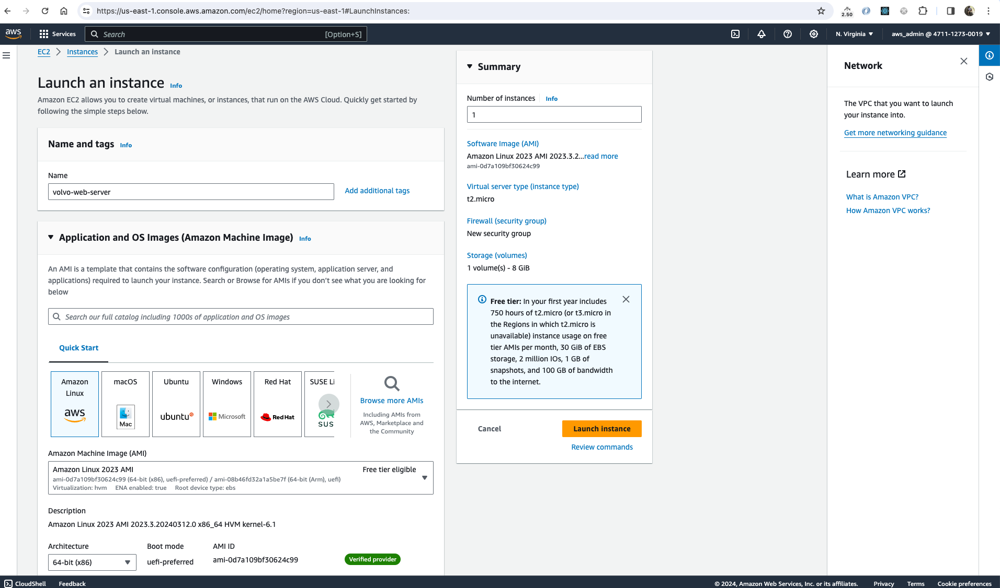
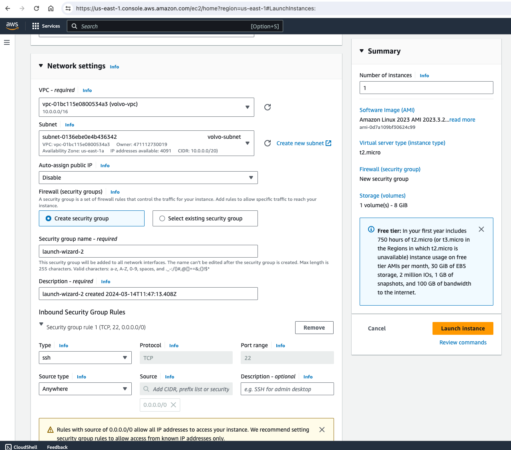
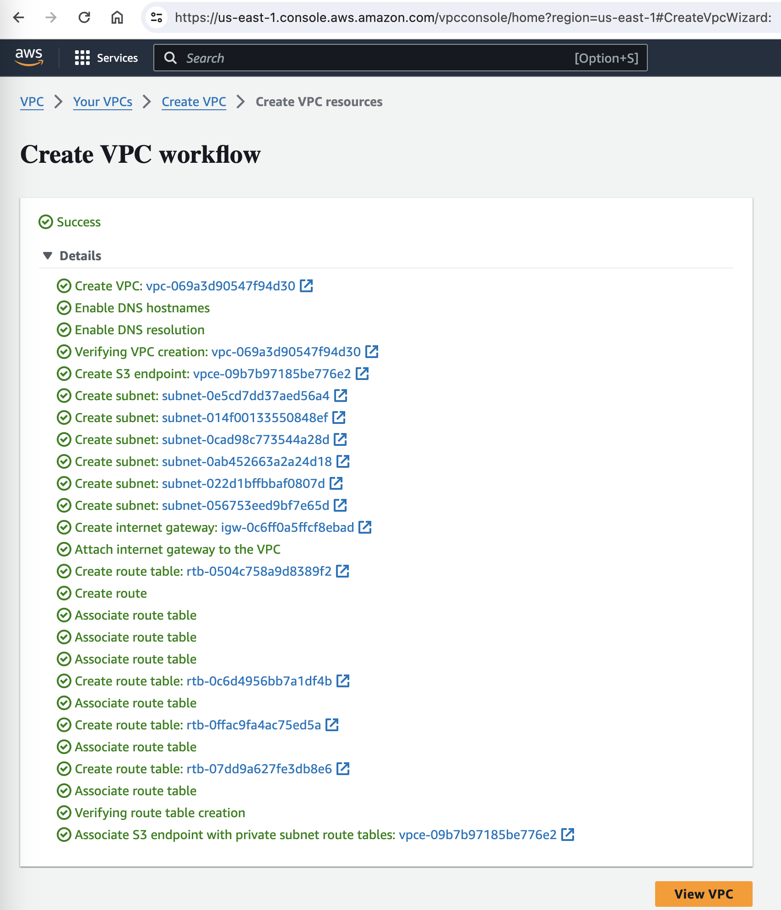

# platform-engineering-aws

Platform Engineering Practical Test - Volvo

# using VPC

# AWS commands

sudo yum install -y git
git clone https://github.com/Abinash04/platform-engineering-aws.git
cd platform-engineering-aws/
cd volvo-platform-app/
sudo yum install docker -y
sudo systemctl start docker
sudo docker build -t volvo-image .
sudo docker run -it -p 8000:8000 volvo-image

Need to open the port 8000 in the Inbound ingress rules under the security group to access the application.
Need to create AWS access key

# Kubectl set up

curl -O https://s3.us-west-2.amazonaws.com/amazon-eks/1.29.0/2024-01-04/bin/linux/amd64/kubectl
chmod +x kubectl
sudo cp kubectl /bin
kubectl version --client

# eksctl set up

curl --silent --location "https://github.com/weaveworks/eksctl/releases/latest/download/eksctl_$(uname -s)\_amd64.tar.gz" | tar xz -C /tmp
sudo mv /tmp/eksctl /usr/local/bin
eksctl version

# create eks cluster

eksctl create cluster --name volvo-cluster --region us-east-1 --zones=us-east-1a,us-east-1b,us-east-1d --nodegroup-name standard-workers --node-type t3.micro --nodes 3 --nodes-min 1 --nodes-max 4 --managed

cat ~/.kube/config
kubectl get pod
kubectl get ns
kubectl get deployment -A
kubectl get ns -o yaml
kubectl create ns volvo --dry-run=client -o yaml

kubectl get svc -n volvo
kubectl get services
kubectl get deploy
kubectl delete deploy volvo-platform-app-deployment

# check application is working

curl a4b7e063bf59d46f4bd330c50c56d2dd-65090160.us-east-1.elb.amazonaws.com

# delete eks cluster

eksctl delete cluster --name vovlo-cluster
